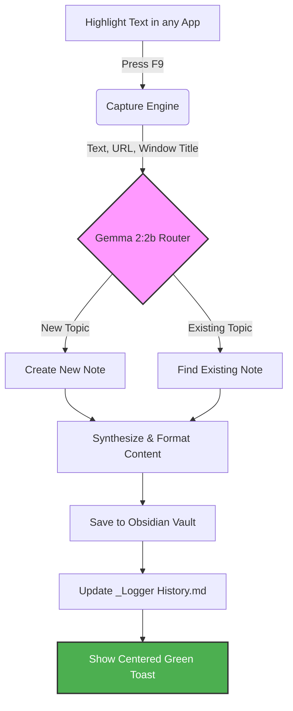

# Intelligent Obsidian Logger

A local, privacy-first AI research assistant that automates logging highlighted text from any application (PDFs, Browser, E-books) directly into your Obsidian vault. Powered by **Gemma 2:2b** via Ollama.

## 🗺️ How it Works




## Features

- **Global Hotkey (F9):** Capture highlighted text from any app.
- **Intelligent Routing:** Gemma 2 decides if the text belongs in an existing note or a new one.
- **Smart Synthesis:** Automatically formats raw text into clean Markdown with bullet points and bold highlights.
- **Metadata Tracking:** Records the source window title, URL (for browsers), and precise timestamp.
- **History Log:** Maintains a master `_Logger History.md` table in your vault for a chronological view of all captures.
- **Desktop Notifications:** Sleek, centered green notifications confirm every successful log.

---

## Setup Instructions

### 1. Prerequisites (For Windows)
- **Python 3.10+** installed.
- **Obsidian** installed with an active vault.
- **Ollama** installed (from [ollama.com](https://ollama.com)).

### 2. Prepare the LLM
Open your terminal and pull the Gemma 2 2B model:
```bash
ollama pull gemma2:2b
```

### 3. Installation
Clone the repository and set up a virtual environment:
```powershell
# Clone the repo
git clone https://github.com/your-username/obsidian-logger.git
cd obsidian-logger

# Create & activate venv
python -m venv venv
.\venv\Scripts\Activate.ps1

# Install dependencies
pip install -r requirements.txt
```

### 4. Configuration
Open `vault_manager.py` and update the `VAULT_PATH` to point to your Obsidian vault:
```python
VAULT_PATH = r"C:\Path\To\Your\Obsidian\Vault"
```

---

## Usage

### Development Mode (Hot-Reloading)
Run the launcher to automatically restart the logger whenever you change the code:
```powershell
python launcher.py
```

### Background Mode (Production)
Run the logger silently in the background without a terminal window:
```powershell
.\venv\Scripts\pythonw.exe main.py
```

### How to Log
1. Highlight any text in any application (PDF reader, browser, etc.).
2. Press **F9**.
3. A centered green notification will confirm the log, and your Obsidian vault will be updated instantly!

---

## History Log
Check your Obsidian Vault for a file named **`_Logger History.md`**. It tracks every capture in a clean, tabulated format.

---

## Built With
- **Ollama / Gemma 2:2b** - Local LLM Engine.
- **Keyboard & Pyperclip** - For hotkey and clipboard handling.
- **UIAutomation & PyGetWindow** - For metadata and URL extraction.
- **Tkinter** - For modern toast notifications.
- **Watchdog** - For the hot-reload launcher.
